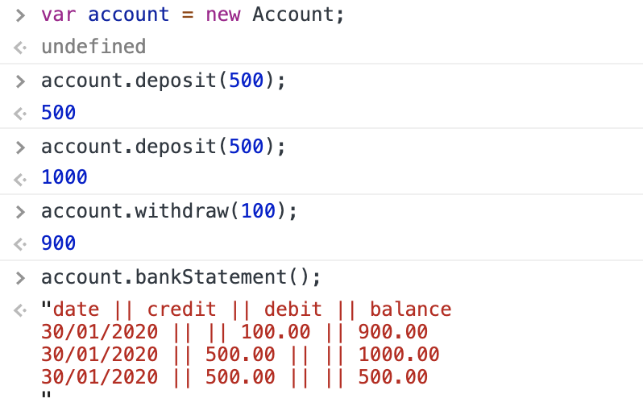
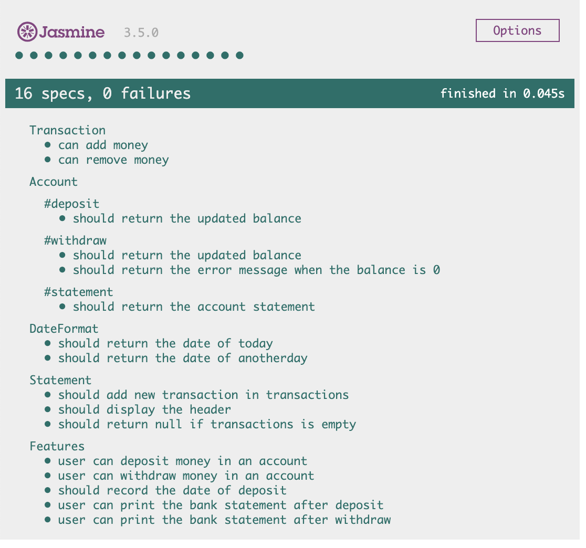

# Bank Tech Test


### Requirements

- You should be able to interact with your code via a REPL like IRB or the JavaScript console. (You don't need to implement a command line interface that takes input from STDIN.)
- Deposits, withdrawal.
- Account statement (date, amount, balance) printing.
- Data can be kept in memory (it doesn't need to be stored to a database or anything).


#### Acceptance criteria:

- Given a client makes a deposit of 1000 on 10-01-2012
- And a deposit of 2000 on 13-01-2012
- And a withdrawal of 500 on 14-01-2012
- When she prints her bank statement
- Then she would see
```
date || credit || debit || balance
14/01/2012 || || 500.00 || 2500.00
13/01/2012 || 2000.00 || || 3000.00
10/01/2012 || 1000.00 || || 1000.00
```


### How to design the solution

- Started with planning the unit specifications
  - At first I put 'deposit' and 'withdraw' functions in `Bank` class, then I realised I needed to break it down to more classes to handle different responsibilities
  - Added `Transaction` class to handle the amount of money; had simple functions 'add' 'remove'
  - Then I needed a `account` class so users can deposit or withdraw money; having balance and transactions as properites
  - Had a seperate class `DateFormat` for recording the date, also returning as DD/MM/YYYY
  - Added `Statement` class for handling the 'display' function and 'log' function to push a single transaction to the properties
  
- Next planning the feature tests to draw out how users interact with the code 
  
- Testing approach
  - Using jasmine testing framework
  - After trying different tools for testing coverage (they might interfering with one another), I used Karma to see the test coverage


### Domain Modelling

**Transaction class**

|Functions | Output|
|------- | ---------|
|add | the amount of transaction|
|remove | the amount of transaction|

**Account class**

|Functions | Output|
|------- | ---------|
|deposit | add the amount to balance<br>push date, credit and balance to the history|
|withdraw | remove the amount from balance<br>push date, debit and balance to the history|

**DateFormat class**

|Functions | Output|
|------- | ---------|
|dateFormat | date of today in the right format|

**Statement class**

|Functions | Output|
|------- | ---------|
|display | bank statement|
|log | push array to transactions|


### User stories
-------

```
As a user
So that I can put my money in the bank
I would like to deposit money in my account

As a user
So that I can take away my money from the bank
I would like to withdraw money from my account

As a user
So I can check my transaction history and account balance
I would like to print out the statement

```


### To install and run the code:

1. Fork the repo
2. Run `npm install`
3. Run `open SpecRunner.html` 
4. Open the console (Ctrl+Option+J)


### To interact with the code:

1. Start with `var account = new Account;`
2. To make a deposit run `account.deposit(amount);` 
3. To make a withdrawal run `account.withdraw(amount);` 
4. To print out the statement run `account.transactions.display();`

See the example:




### To run the test:

1. Run `open SpecRunner.html` 
2. Run `npm test`


### Test results and test coverage




 
