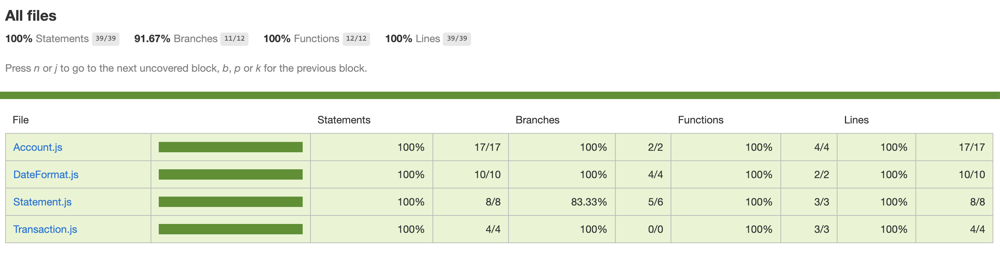

# Bank


### Requirements

- You should be able to interact with your code via a REPL like IRB or the JavaScript console. (You don't need to implement a command line interface that takes input from STDIN.)
- Deposits, withdrawal.
- Account statement (date, amount, balance) printing.
- Data can be kept in memory (it doesn't need to be stored to a database or anything).
- Acceptance criteria:

Given a client makes a deposit of 1000 on 10-01-2012

And a deposit of 2000 on 13-01-2012

And a withdrawal of 500 on 14-01-2012

When she prints her bank statement

Then she would see
```
date || credit || debit || balance
14/01/2012 || || 500.00 || 2500.00
13/01/2012 || 2000.00 || || 3000.00
10/01/2012 || 1000.00 || || 1000.00
```

### How to design the solution

At first, I was thinking about when 

Karma


**Transaction class**

|Functions | Output|
|------- | ---------|
|add | to add the amount of money|
|remove | Check|

**Account class**

|Functions | Output|
|------- | ---------|
|check | Check|

**DateFormat class**

|Functions | Output|
|------- | ---------|
|check | Check|

**Statement class**

|Functions | Output|
|------- | ---------|
|check | Check|


### To install and run the code:

1. Fork the repo
2. Run `npm install`
3. Run `open SpecRunner.html` 
4. Open the console (Ctrl+Option+J)

### To interact with the code:

1. Start with `var account = new Account;`
2. To make a deposit run `account.deposit(amount);` 
3. To make a withdrawal run `account.withdraw(amount);` 
4. To print out the statement run `account.transactions.display();`

See the example:


### To run the test:

1. Run `open SpecRunner.html` 
2. Run `npm test`


### User stories
-------

```
As a user
So that I can put my money in the bank
I would like to deposit money in my account

As a user
So that I can take away my money from the bank
I would like to withdraw money from my account

As a user
So I can check my transaction history and account balance
I would like to print out the statement

```

### Screen shots of the app





### The extensions I would add

 
